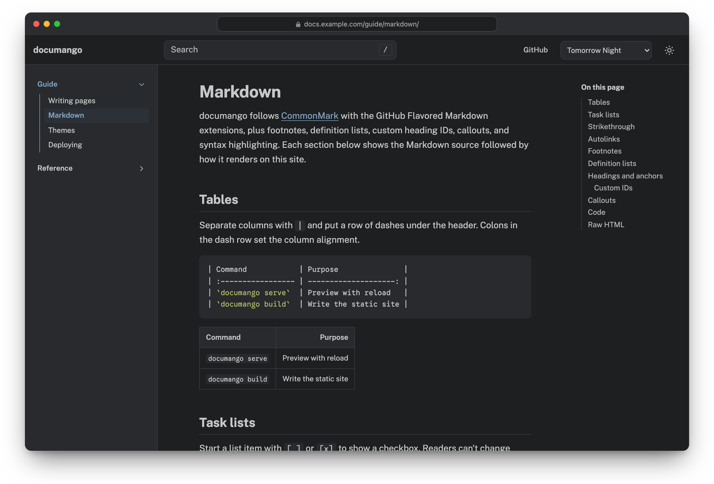
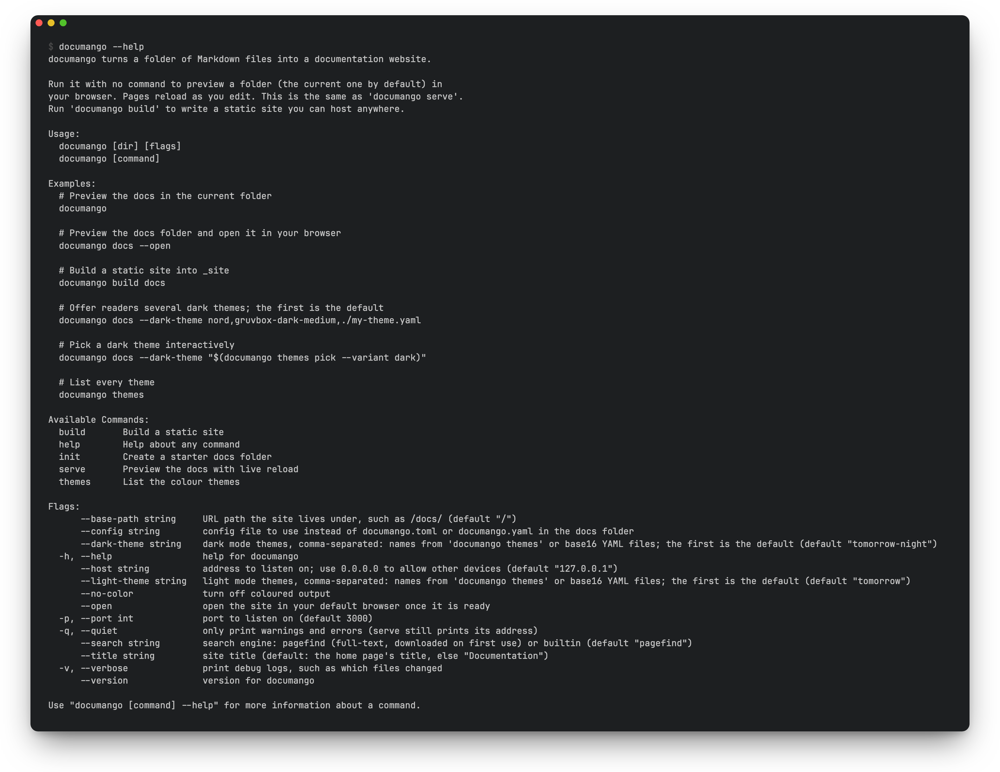
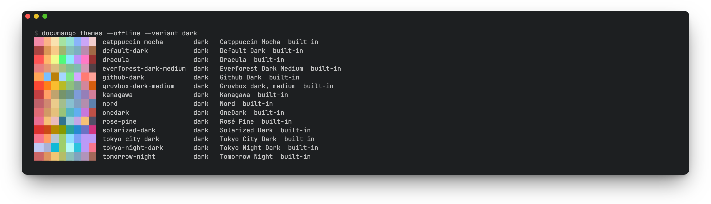

# documango

documango turns a directory of Markdown files into a documentation website.
It runs a development server that reloads the browser when you save a file,
and builds a static site you can host anywhere. The sidebar comes from your
folder structure, and every site has search and a light and dark theme. An
optional `documango.toml` or `documango.yaml` sets the title, page metadata,
themes, fonts and header links; see [configuration](docs/reference/configuration.md).

<picture>
  <source media="(prefers-color-scheme: light)" srcset=".github/assets/site-light.png">
  
</picture>

## Install

With Go 1.25 or later:

```sh
go install github.com/desertthunder/documango/cmd/documango@latest
```

Or build from a clone of this repository:

```sh
go build ./cmd/documango
```

## Quick start

```sh
documango docs                 # serve docs/ at http://127.0.0.1:3000 with live reload
documango build docs           # write the static site to _site/
documango themes               # list the color schemes
```

## Command line

Run `documango --help` for every command and flag, or add `--help` after a
command such as `build`.



`documango themes` lists the built-in color schemes with a sample of each:



## Documentation

The documentation is in [`docs/`](docs/index.md) and is itself a documango
site. To read it from a clone of this repository, run documango against it
from the repository root:

```sh
go run ./cmd/documango docs         # preview at http://127.0.0.1:3000/
go run ./cmd/documango build docs   # write the static site to _site/
```

## Credits

The built-in color schemes come from
[tinted-theming/schemes](https://github.com/tinted-theming/schemes) under the
MIT License. See [`internal/theme/schemes/LICENSE`](internal/theme/schemes/LICENSE).
